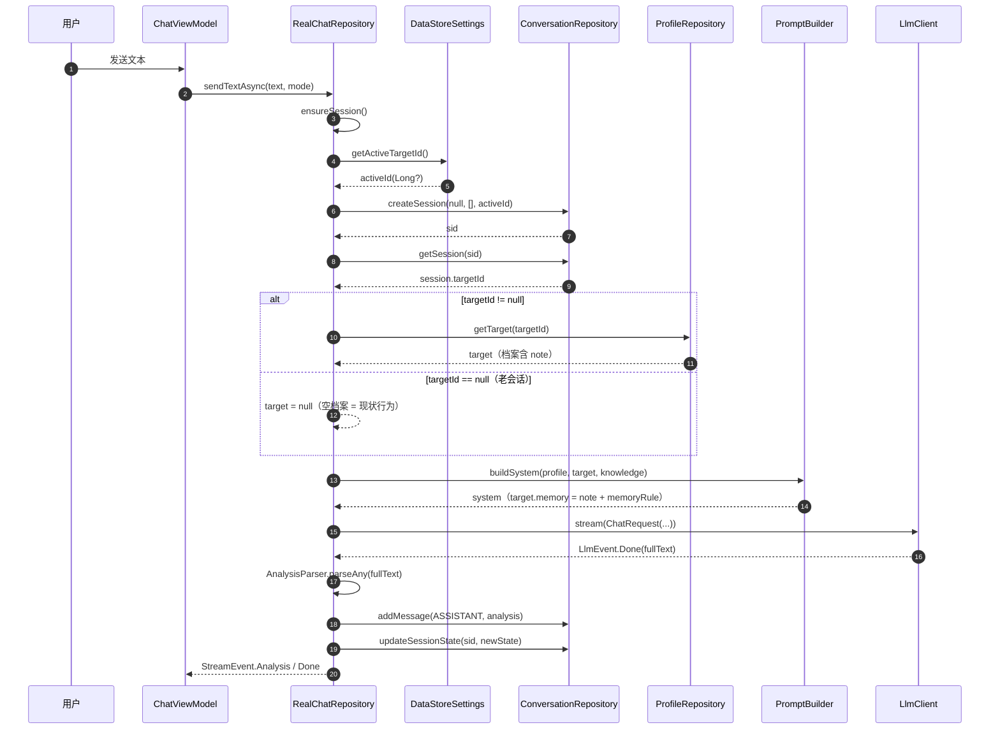
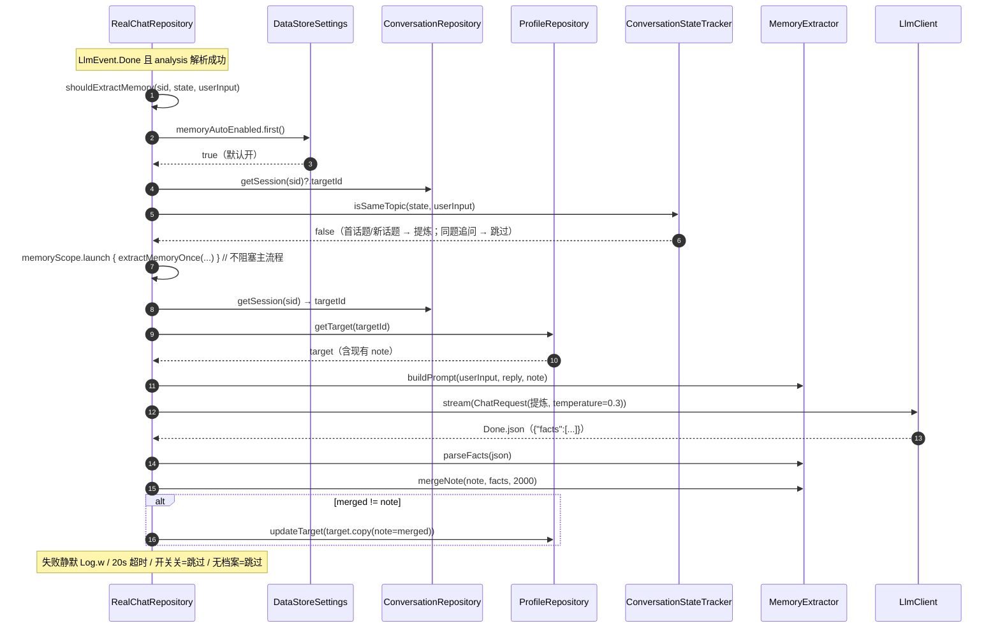
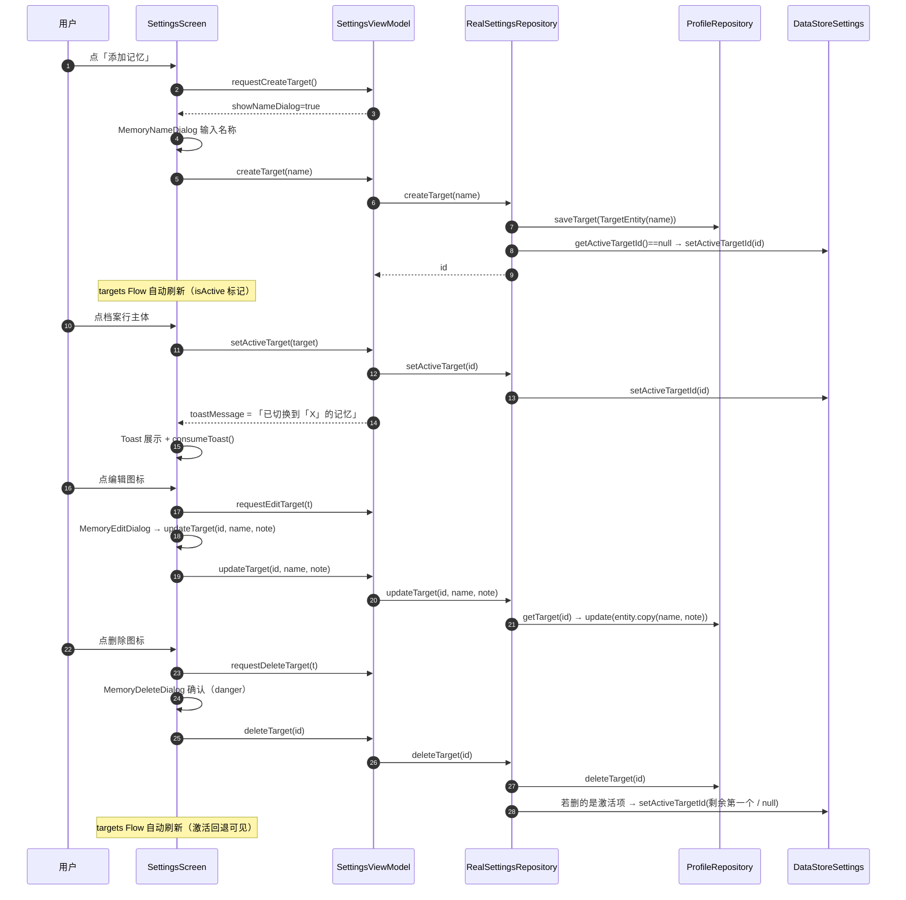

# 温言 v1.7.2 增量系统设计 + 任务分解

> 作者：高见远（架构师）｜日期：2026-08-06
> 依据：`docs/prd-memory-v172.md`（R1-R9）+ 迭代计划 v2（`~/.workbuddy/plans/wenyan-v172-memory.md`）
> 基础版本：v1.7.1（versionCode 26）→ v1.7.2（versionCode 27）
> 范围：**仅记忆相关链路增量**，最小变更原则，其余模块零改动
> 代码已核实：DB v4 / 6 表 / MIGRATION 模式 / DataStore 5 key / 三处 getTarget() 注入点 / titleScope 静默模式 / Tag(TagKind) 组件均确认

---

## 1. 实现方案概述

**一句话**：target 表从「MVP 单行」升级为「多记忆档案」（新增 note 记忆正文字段），session 表新增可空 targetId 绑定归属档案；聊天注入从「全局最新一行」改为「会话归属档案优先」；回复完成后按「新话题」节流自动提炼新事实写回档案 note；设置页新增「记忆」分组做档案 CRUD + 激活切换 + 自动记忆开关；隐私清除零改动自动覆盖新数据。

**核心决策（延续计划 v2，均已确认）**：

| 决策 | 方案 |
|------|------|
| 多档案载体 | target 表多行化，`note` 存记忆正文（默认空串） |
| 会话归属 | session.targetId 可空；新会话创建时写入当前激活档案 id；**切档案只影响新会话** |
| 注入规则 | 会话归属档案优先（`session.targetId → getTarget(id)`）；老会话 null → 空档案 = 现状行为 |
| 自动提炼 | 新文件 `domain/MemoryExtractor.kt`（纯逻辑）；三处 Done 挂点；仅首话题/新话题提炼一次；开关默认开；20s 超时失败静默；merge 去重幂等 |
| Prompt 生效 | `buildProfileJson` target 加 `memory` 字段（=note）；【system-档案】段追加记忆使用规则 |
| 档案 CRUD | 新建/改名+编辑正文/删除（二次确认 danger）；删激活项→自动激活剩余第一个，无剩余→null |
| 切换 Toast | 「已切换到「X」的记忆」（精确文案） |
| 隐私清除 | `wipeAll()` 现有链路已含 `dataStore.clearAll()` + target/session 表清空，**零代码改动自动覆盖**新 key 与新表数据 |

**技术选型**：不引入任何新依赖。Room 2.6.1 显式 Migration（沿用 MIGRATION_1_2/2_3/3_4 模式）、Preferences DataStore 1.1.1、org.json 防御性解析（对齐 AnalysisParser）、kotlinx.coroutines（复用 titleScope 的「独立 scope + 幂等 + 失败静默 + withTimeout」成熟模式）。

---

## 2. 文件列表

### 2.1 修改 18 个

| # | 文件 | 具体改动点 |
|---|------|-----------|
| 1 | `app/app/build.gradle.kts` | `versionCode = 27`、`versionName = "1.7.2"`，变更注释追加 v1.7.2 一行 |
| 2 | `data/db/TargetEntity.kt` | +`val note: String = ""`（记忆正文，默认空串；类注释更新「MVP 单行」→「多档案」） |
| 3 | `data/db/TargetDao.kt` | 多行 CRUD：删 `getLatest/observeLatest`；+`observeAll()` / `getById(id)` / `@Update update(entity)` / `deleteById(id)`；保留 `insert`、`clear` |
| 4 | `data/db/SessionEntity.kt` | +`val targetId: Long? = null`（所属档案，可空；注释标注 DB v5 新增） |
| 5 | `data/db/AppDatabase.kt` | version 4→**5**；+`MIGRATION_4_5`（两条 ALTER，见 §3.1）；`addMigrations` 追加；KSP 自动导出 schema `5.json` 需提交入库 |
| 6 | `data/datastore/SettingsRepository.kt` | Keys +`ACTIVE_TARGET_ID`(long) / `MEMORY_AUTO_ENABLED`(boolean)；+`activeTargetId: Flow<Long?>`、`setActiveTargetId(Long?)`、`getActiveTargetId()`；+`memoryAutoEnabled: Flow<Boolean>`（默认 **true**）、`setMemoryAutoEnabled(Boolean)`；`clearAll()` 不动（自动覆盖新 key） |
| 7 | `data/repository/ProfileRepository.kt` | 单行 API→多档案 API（见 §3.2）；**不持有 DataStore**（激活 id 由调用方注入，最小侵入）；删 `observeTarget()/getTarget()` |
| 8 | `data/repository/ConversationRepository.kt` | `createSession(scenarioTag, refDocs, targetId: Long? = null)` 新参数透传 |
| 9 | `ui/contract/AppContainer.kt` | `SettingsRepository` 接口 +7 个记忆成员（见 §3.3） |
| 10 | `ui/contract/Models.kt` | +`data class TargetUi(...)`；`SessionSummaryUi` +`targetName: String? = null`（见 §3.4） |
| 11 | `container/RealSettingsRepository.kt` | 实现记忆数据流与操作（见 §3.3）；`wipeAll()` 不动 |
| 12 | `container/UiMappers.kt` | +`fun toTargetUi(e: TargetEntity, isActive: Boolean): TargetUi` |
| 13 | `container/RealChatRepository.kt` | ①`ensureSession()` 写 `dataStore.getActiveTargetId()` ②三处 `getTarget()` → `resolveTarget(sid)` ③`sessions` combine 第三路档案→targetName ④三处 Done 挂自动提炼（见 §3.5）⑤+`memoryScope`/`shouldExtractMemory`/`extractMemoryOnce` |
| 14 | `container/RealOnboardingRepository.kt` | `submit()` 建档后：`if (dataStore.getActiveTargetId() == null) dataStore.setActiveTargetId(新id)`（首个档案自动激活） |
| 15 | `prompt/PromptBuilder.kt` | `buildProfileJson` target 对象 +`memory` 字段（=target?.note ?: ""，空串输出空串）；`buildSystem` 在【system-档案】JSON 后按需追加 `CorePrompt.memoryRule` |
| 16 | `prompt/CorePrompt.kt` | +`val memoryRule: String`（记忆使用规则文案，建议稿见 §3.6，需评审） |
| 17 | `ui/settings/SettingsViewModel.kt` | +`targets/activeTargetId/memoryAutoEnabled/toastMessage` 状态流 + 弹窗状态（showNameDialog/editTarget/deleteTarget）+ 7 个操作函数（见 §3.7） |
| 18 | `ui/settings/SettingsScreen.kt` | 「模型服务」与「外观」之间插入「记忆」分组：档案行（玻璃行+激活对勾+编辑/删除图标）、「添加记忆」行、自动记忆 Switch 行、空状态提示、caption；`LaunchedEffect` 消费 Toast（见 §3.7） |

### 2.2 新增 5 个

| # | 文件 | 职责 |
|---|------|------|
| 1 | `ui/settings/MemoryDialogs.kt` | 三个弹窗：`MemoryNameDialog`（新建，空白不允许，accent 确认）/ `MemoryEditDialog`（改名+正文多行 2-4 行）/ `MemoryDeleteDialog`（二次确认，danger 确认钮），风格对齐 PrivacyDialogs.kt（AlertDialog + GtjShape.lg） |
| 2 | `domain/MemoryExtractor.kt` | 自动提炼纯逻辑：`buildPrompt` / `parseFacts` / `mergeNote`（见 §3.5），无 Android 依赖，JVM 可测 |
| 3 | `data/repository/ProfileRepositoryMemoryTest.kt` | 多档案 CRUD（fake DAO：内存实现 TargetDao/ProfileDao 接口） |
| 4 | `ui/settings/SettingsViewModelMemoryTest.kt` | 列表装配 / 激活+Toast / 新建自动激活 / 改名 / 删除回退（fake SettingsRepository） |
| 5 | `prompt/PromptBuilderMemoryTest.kt` | `buildProfileJson` memory 字段注入断言 + CorePrompt.memoryRule 存在性 |

**测试另增**（并入 T05，非独立文件清单项）：`domain/MemoryExtractorTest.kt`（buildPrompt 契约 / parseFacts 防御 / mergeNote 去重与 2000 上限）+ 回归现有 251 单测；QA 侧在 `RealSettingsRepositoryTest` 扩展会话装配 targetName 用例。

**文档 4 个**（并入 T05）：`docs/db-schema.md`（target 多行化 + note 列 + session.targetId + v5 迁移 + DataStore 新 key）、`CHANGELOG.md`、`dist/README.md`（v1.7.2 章节）、`docs/SPEC.md`（记忆功能章节）。

---

## 3. 数据结构与接口

### 3.1 DB v5 迁移

```sql
-- MIGRATION_4_5（Room version 4 → 5，两条 ALTER，老数据不丢）
ALTER TABLE target ADD COLUMN note TEXT NOT NULL DEFAULT ''
ALTER TABLE session ADD COLUMN targetId INTEGER   -- 可空，无 DEFAULT
```

`AppDatabase`：`version = 5`，`addMigrations(MIGRATION_1_2, MIGRATION_2_3, MIGRATION_3_4, MIGRATION_4_5)`；KSP 生成 `app/schemas/com.wenyan.app.data.db.AppDatabase/5.json` 必须提交入库（exportSchema=true 基线）。

### 3.2 TargetDao / ProfileRepository 新 API

```kotlin
// data/db/TargetDao.kt
@Dao
interface TargetDao {
    @Query("SELECT * FROM target ORDER BY id DESC")
    fun observeAll(): Flow<List<TargetEntity>>          // 新：全档案（id DESC，最新在前）

    @Query("SELECT * FROM target WHERE id = :id")
    suspend fun getById(id: Long): TargetEntity?          // 新

    @Insert
    suspend fun insert(entity: TargetEntity): Long        // 保留

    @Update
    suspend fun update(entity: TargetEntity)              // 新：改名/编辑正文

    @Query("DELETE FROM target WHERE id = :id")
    suspend fun deleteById(id: Long)                      // 新

    @Query("DELETE FROM target")
    suspend fun clear()                                   // 保留
    // 删除：getLatest / observeLatest（唯一调用方 ProfileRepository 同步改造）
}

// data/repository/ProfileRepository.kt
class ProfileRepository(private val profileDao: ProfileDao, private val targetDao: TargetDao) {
    fun observeProfile(): Flow<ProfileEntity?> = profileDao.observeLatest()
    suspend fun getProfile(): ProfileEntity? = profileDao.getLatest()
    suspend fun saveProfile(entity: ProfileEntity): Long = profileDao.insert(entity)

    // —— 多档案（不持有 DataStore，激活 id 由调用方注入）——
    fun observeTargets(): Flow<List<TargetEntity>> = targetDao.observeAll()
    suspend fun getTarget(id: Long): TargetEntity? = targetDao.getById(id)
    suspend fun saveTarget(entity: TargetEntity): Long = targetDao.insert(entity)
    suspend fun updateTarget(entity: TargetEntity) = targetDao.update(entity)
    suspend fun deleteTarget(id: Long) = targetDao.deleteById(id)

    suspend fun clearAll() { profileDao.clear(); targetDao.clear() }
    // 删除：observeTarget() / getTarget()（无参）——三处调用方（RealChatRepository 162/314/511）改 resolveTarget
}

// data/repository/ConversationRepository.kt（仅签名变化）
suspend fun createSession(scenarioTag: String?, refDocs: List<String>, targetId: Long? = null): Long
```

### 3.3 SettingsRepository 新增契约（ui/contract/AppContainer.kt + RealSettingsRepository）

```kotlin
// —— SettingsRepository 接口新增 ——
val targets: Flow<List<TargetUi>>            // combine(targetDao.observeAll + dataStore.activeTargetId) → isActive 标记
val activeTargetId: Flow<Long?>
val memoryAutoEnabled: Flow<Boolean>         // 默认 true
suspend fun createTarget(name: String): Long // 创建；当前无激活档案 → 自动激活该档案
suspend fun updateTarget(id: Long, name: String, note: String)
suspend fun deleteTarget(id: Long)           // 删激活项 → 自动激活剩余第一个（observeAll 第一条）；无剩余 → null
suspend fun setActiveTarget(id: Long)
suspend fun setMemoryAutoEnabled(enabled: Boolean)

// —— RealSettingsRepository 关键实现 ——
override val targets: Flow<List<TargetUi>> =
    combine(profileRepository.observeTargets(), dataStore.activeTargetId) { list, activeId ->
        list.map { UiMappers.toTargetUi(it, isActive = it.id == activeId) }
    }

override suspend fun createTarget(name: String): Long {
    val trimmed = name.trim(); if (trimmed.isEmpty()) return -1L   // 防御：UI 已禁空白
    val id = profileRepository.saveTarget(TargetEntity(codeName = trimmed))
    if (dataStore.getActiveTargetId() == null) dataStore.setActiveTargetId(id)
    return id
}

override suspend fun updateTarget(id: Long, name: String, note: String) {
    val e = profileRepository.getTarget(id) ?: return
    profileRepository.updateTarget(e.copy(codeName = name.trim(), note = note.trim()))
}

override suspend fun deleteTarget(id: Long) {
    profileRepository.deleteTarget(id)
    if (dataStore.getActiveTargetId() == id) {
        dataStore.setActiveTargetId(profileRepository.observeTargets().first().firstOrNull()?.id)
    }
}
```

`wipeAll()` 零改动：`profileRepository.clearAll()` 已清 target 表、`dataStore.clearAll()` 已清全部 key（含新 key）→ **R9 自动满足**。

### 3.4 UI 契约模型（ui/contract/Models.kt + UiMappers.kt）

```kotlin
data class TargetUi(
    val id: Long,
    val name: String,          // = codeName
    val note: String,          // 记忆正文
    val createdAt: Long,
    val isActive: Boolean,     // id == 激活档案
)

data class SessionSummaryUi(
    val id: Long,
    val title: String,
    val createdAt: Long,
    val targetName: String? = null,   // 会话归属档案名；老会话 null
)

// UiMappers
fun toTargetUi(e: TargetEntity, isActive: Boolean): TargetUi = TargetUi(
    id = e.id, name = e.codeName, note = e.note, createdAt = e.createdAt, isActive = isActive,
)
```

### 3.5 MemoryExtractor（新文件，纯逻辑）

```kotlin
package com.wenyan.app.domain

object MemoryExtractor {
    const val DEFAULT_NOTE_LIMIT = 2000

    /** 提炼 prompt：从本轮（用户输入 + 军师回复）提炼「关于咨询对象的新事实」；
     *  已存在于 existingNote 的重复事实不输出；无新事实输出 {"facts":[]}；
     *  输出 JSON 契约：{"facts":["…","…"]}（每条 ≤40 字，≤5 条）。 */
    fun buildPrompt(userInput: String, replyText: String, existingNote: String): String

    /** 防御性解析（对齐 AnalysisParser：stripFence + opt 系列 + runCatching）：
     *  非 JSON / 缺 facts / 字段非法 → 返回空列表，绝不抛异常。 */
    fun parseFacts(json: String): List<String>

    /** 追加式合并：trim+去重（保序）；与已有 note 任一片段（按 \n；。切分）互含重叠则跳过；
     *  无新事实返回原 note；追加用「；」分隔；整体 take(limit) 截断（默认 2000 字）。
     *  幂等兜底：重复触发不会重复追加。 */
    fun mergeNote(existingNote: String, facts: List<String>, limit: Int = DEFAULT_NOTE_LIMIT): String
}
```

**RealChatRepository 提炼挂点**（三处 `LlmEvent.Done` 分支、`analysis != null` 时）：

```kotlin
// 节流判定（纯判定 + 读开关/档案，不写状态）
private suspend fun shouldExtractMemory(sid: Long, state: ConversationState, userInput: String): Boolean {
    if (!dataStore.memoryAutoEnabled.first()) return false
    val targetId = conversationRepository.getSession(sid)?.targetId ?: return false   // 无档案不提炼
    if (profileRepository.getTarget(targetId) == null) return false
    return !state.hasActiveTopic || !stateTracker.isSameTopic(state, userInput)      // 首话题/新话题
}

// 执行（独立 scope + 幂等 + 失败静默 + 20s 超时，仿 generateTitleOnce）
private suspend fun extractMemoryOnce(sid: Long, userInput: String, replyFullText: String) {
    runCatching {
        withTimeout(MEMORY_TIMEOUT_MS) {
            val targetId = conversationRepository.getSession(sid)?.targetId ?: return@withTimeout
            val target = profileRepository.getTarget(targetId) ?: return@withTimeout
            val reply = runCatching { AnalysisParser.parse(replyFullText).reply }.getOrDefault(replyFullText)
            val prompt = MemoryExtractor.buildPrompt(userInput, reply, target.note)
            val client = resolveClient() ?: return@withTimeout
            val json = client.client.stream(ChatRequest(client.model, MEMORY_SYSTEM_PROMPT, prompt, temperature = 0.3))
                .filterIsInstance<LlmEvent.Done>().firstOrNull()?.fullText
            val facts = MemoryExtractor.parseFacts(json ?: "")
            val merged = MemoryExtractor.mergeNote(target.note, facts)
            if (merged != target.note) profileRepository.updateTarget(target.copy(note = merged))
        }
    }.onFailure { Log.w("RealChatRepository", "memory extraction failed", it) }
}

// 挂点（三处，参数差异见下）
// sendTextFlow Done：      if (analysis != null && persistUser && shouldExtractMemory(sid, state, text))
//                              memoryScope.launch { extractMemoryOnce(sid, text, event.fullText) }
// runVisionDirect Done：   if (analysis != null && shouldExtractMemory(sid, ConversationState.fromJson(getSessionState(sid)), text))
//                              memoryScope.launch { extractMemoryOnce(sid, text, event.fullText) }
// confirmTranscription Done：同 runVisionDirect（input 用 transcription）
```

常量：`MEMORY_TIMEOUT_MS = 20_000L`、`MEMORY_SYSTEM_PROMPT = "你是记忆提炼器。只输出 JSON，不加解释。"`（均入 companion object）。

### 3.6 CorePrompt.memoryRule（建议稿，待评审）

```kotlin
// CorePrompt.kt 新增
val memoryRule: String = """
记忆使用规则（target.memory 为已记住的关于咨询对象的信息）：
- 基于其中已记住的信息与用户保持前后一致，回答不得与已记住信息矛盾；
- 用户本轮未提到、且记忆中也没有的信息，不得编造成记忆内容或当作事实输出；
- 记忆与用户新提供信息冲突时，以新信息为准并温和指出差异。
""".trimIndent()

// PromptBuilder.buildSystem 改动（仅当确有记忆时追加，保持 prompt 精简）
if (!target?.note.isNullOrBlank()) {
    append("\n\n").append(CorePrompt.memoryRule)
}
```

### 3.7 设置页「记忆」分组（SettingsViewModel + SettingsScreen + MemoryDialogs）

**VM 新增状态**：`targets: StateFlow<List<TargetUi>>`、`activeTargetId: StateFlow<Long?>`、`memoryAutoEnabled: StateFlow<Boolean>`、`toastMessage: StateFlow<String?>`（一次性事件，消费后清空）、`showNameDialog: StateFlow<Boolean>`、`editTarget: StateFlow<TargetUi?>`、`deleteTarget: StateFlow<TargetUi?>`。

**VM 新增操作**：`createTarget(name)`、`updateTarget(id, name, note)`、`deleteTarget(id)`、`setActiveTarget(target)`（调 repo 后置 `toastMessage = "已切换到「${target.name}」的记忆"`）、`setMemoryAutoEnabled(enabled)`、`requestCreateTarget()/dismissCreateTarget()`、`requestEditTarget(t)/dismissEditTarget()`、`requestDeleteTarget(t)/dismissDeleteTarget()`、`consumeToast()`。

**Screen 分组顺序**（插入「模型服务」之后、「外观」之前）：

```
ThickDivider
SettingsSectionHeader("记忆")
  ├─ targets 为空 → muted 文本「还没有记忆档案，添加一个开始使用」
  ├─ MemoryTargetRow(target, onClick=setActiveTarget, onEdit, onDelete)   // GlassSurface 玻璃行
  │    左侧：isActive → Icon(CheckCircle, accent, 20dp) / 否则空心圆(2dp border muted)
  │    中部：名称 Body + caption（激活="使用中"或"使用中 · 已记住 N 字"；未激活="未使用"）
  │    右侧：GtjIconButton(Edit, 20dp) + GtjIconButton(Delete, 20dp, danger)
  ├─ 「添加记忆」行：Text(accent) + GtjIconButton(Add, accent) → MemoryNameDialog
  ├─ 自动记忆 Switch 行（玻璃行 + Switch，checked=memoryAutoEnabled）
  ├─ caption「选择本次咨询对象的记忆，不同对象互不干扰」
ThickDivider
SettingsSectionHeader("外观")
```

Toast 消费：`LaunchedEffect(toastMessage) { toastMessage?.let { Toast.makeText(ctx, it, LENGTH_SHORT).show(); vm.consumeToast() } }`。

**MemoryDialogs.kt**（对齐 PrivacyDialogs.kt：AlertDialog + GtjShape.lg + surfaceElevated 容器）：

| 弹窗 | 触发 | 内容 |
|------|------|------|
| `MemoryNameDialog(onDismiss, onConfirm: (String) -> Unit)` | 添加记忆行 | 名称 TextField，确认钮 accent，输入空白禁用确认 |
| `MemoryEditDialog(initialName, initialNote, onDismiss, onSave: (String, String) -> Unit)` | 档案行编辑图标 | 名称 TextField + 正文多行 TextField（2-4 行），保存钮 → updateTarget |
| `MemoryDeleteDialog(targetName, onDismiss, onConfirm)` | 档案行删除图标 | 标题「删除记忆」、正文「删除后「X」的记忆将无法恢复，确定删除？」、确认钮 danger（复用 WipeDialog 模板） |

---

## 4. 程序调用流程

### 4.1 时序图① 发送消息 → 注入会话档案



### 4.2 时序图② 回复完成 → 自动提炼



### 4.3 时序图③ 设置页记忆 CRUD



---

## 5. 任务列表（有序，按依赖）

> 硬性约束：≤5 任务；每个任务 ≥3 文件；T01 = 基础设施/数据地基。依赖为扇出结构（T01→T02→T03/T04 并行→T05），避免深链。

| 任务 | 名称 | 涉及文件 | 依赖 | 优先级 |
|------|------|----------|------|--------|
| **T01** | 项目基础设施 + DB v5 地基 | `app/app/build.gradle.kts`、`data/db/TargetEntity.kt`、`data/db/SessionEntity.kt`、`data/db/TargetDao.kt`、`data/db/AppDatabase.kt` | 无 | P0 |
| **T02** | 数据仓库层 + 契约 | `data/datastore/SettingsRepository.kt`、`data/repository/ProfileRepository.kt`、`data/repository/ConversationRepository.kt`、`container/RealOnboardingRepository.kt`、`ui/contract/Models.kt`、`ui/contract/AppContainer.kt`、`container/UiMappers.kt` | T01 | P0 |
| **T03** | 设置页「记忆」分组 UI | `container/RealSettingsRepository.kt`、`ui/settings/SettingsViewModel.kt`、`ui/settings/SettingsScreen.kt`、`ui/settings/MemoryDialogs.kt`（新） | T02 | P0 |
| **T04** | 聊天链路 + 自动提炼 + Prompt | `container/RealChatRepository.kt`、`ui/chat/SessionDrawer.kt`、`prompt/PromptBuilder.kt`、`prompt/CorePrompt.kt`、`domain/MemoryExtractor.kt`（新） | T02 | P0 |
| **T05** | 测试落点 + 文档收尾 | `data/repository/ProfileRepositoryMemoryTest.kt`（新）、`ui/settings/SettingsViewModelMemoryTest.kt`（新）、`prompt/PromptBuilderMemoryTest.kt`（新）、`domain/MemoryExtractorTest.kt`（新）、`docs/db-schema.md`、`CHANGELOG.md`、`dist/README.md`、`docs/SPEC.md` | T02、T03、T04 | P0 |

**实现顺序建议**：T01 → T02 → T03‖T04 → T05（T03 与 T04 可并行，均只依赖 T02）。

**T01 验收**：`assembleDebug` 通过；DB 升级 v5 后老数据不丢（target 行 note=''、session 行 targetId=null）；`app/schemas/.../5.json` 生成并提交。
**T02 验收**：编译通过；ProfileRepository 无参 `getTarget()/observeTarget()` 已删除且无残留调用。
**T03 验收**：设置页「记忆」分组视觉与其余分组一致；新建/改名/删除/切换激活 + Toast 文案精确；删激活项自动回退。
**T04 验收**：新会话带激活档案、老会话空档案；抽屉档案 Tag（take(4)）；回复后新话题自动提炼、同题不提炼、开关关全禁用；Prompt 含 memory 字段与规则。
**T05 验收**：新增 4 个测试文件全绿 + 251 单测回归全绿；`scripts/run_gradle.sh assembleRelease` 通过（versionCode 27）。

---

## 6. 依赖包与共享知识

### 6.1 依赖包

**无新增**（已确认）：Room 2.6.1 / DataStore 1.1.1 / OkHttp 4.12.0 / coroutines 1.8.1 / org.json 均已在依赖中；MemoryExtractor 仅用 org.json + kotlin 标准库，JVM 可测。

### 6.2 共享知识（跨文件约定）

- **targetTagText 规则**：抽屉档案 Tag 显示 `name.trim().take(4)`——≤4 字全显，>4 字截前 4 字，不做省略号（Tag 自适应宽度）；空名称不显示 Tag；`targetName=null`（老会话）不显示。
- **Tag 组件**：`ui/components/GtjCard.kt` 的 `Tag(text, kind=TagKind.NEUTRAL)`；抽屉场景选 **NEUTRAL**（当前会话行已有 accent 高亮，避免色噪）。
- **空档案行为**：老会话 targetId=null → 注入空档案（现状行为）、抽屉无 Tag、自动提炼跳过；切档案只影响新会话。
- **note 上限**：2000 字（`MemoryExtractor.DEFAULT_NOTE_LIMIT`）；mergeNote 追加式截断；弹窗编辑所见即所得，不额外限输入。
- **自动提炼节流**：仅首话题/新话题轮提炼一次（复用 `ConversationStateTracker.isSameTopic`，不写状态）；失败静默 `Log.w`；20s 超时；开关关完全跳过；`persistUser=false`（重试）不触发。
- **Toast 文案**（精确）：`已切换到「X」的记忆`。
- **删除回退**：删激活项 → 自动激活 `observeAll()` 第一条（id DESC，最新档案）；无剩余 → activeTargetId=null。
- **迁移纪律**：显式 Migration 对象，禁止 fallbackToDestructiveMigration；schema JSON 提交入库；新 key 一律走 `clearAll()` 自动覆盖（wipe 零改动）。
- **时间戳**：统一 epoch millis（Long）；JSON 字段用 org.json 序列化（不新增依赖）。
- **防御性解析**：模型输出解析一律「stripFence + opt 系列 + runCatching」，失败返回空/默认值，绝不抛到主流程（对齐 AnalysisParser）。

---

## 7. 待明确事项

**无阻塞性待确认项**（计划 v2 已确认全部决策点）。以下为本设计已定夺的细节，供评审知悉、无需工程师再问：

1. **CorePrompt.memoryRule 文案**：§3.6 为建议稿，措辞需 PM/架构终审（仅影响文案，不影响结构）。
2. **mergeNote 重叠判定细则**：整句互含 + 长度 ≥6 字片段包含判定（§3.5），确定性可测；若评审认为过严/过松可调。
3. **抽屉 Tag kind**：定为 `TagKind.NEUTRAL`。
4. **删除后「剩余第一个」**：定义为 `observeAll()` 第一条（id DESC = 最新档案）。
5. **激活档案 caption**：激活 =「使用中」/「使用中 · 已记住 N 字」；未激活 =「未使用」。
6. **memoryRule 注入时机**：仅 target.note 非空时追加（prompt 精简）。
