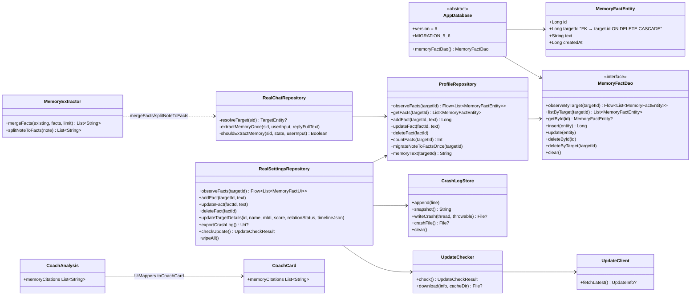
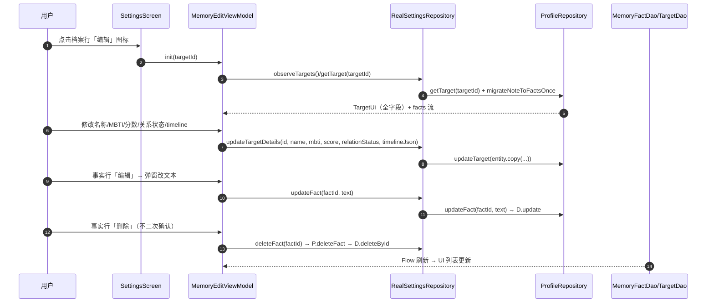
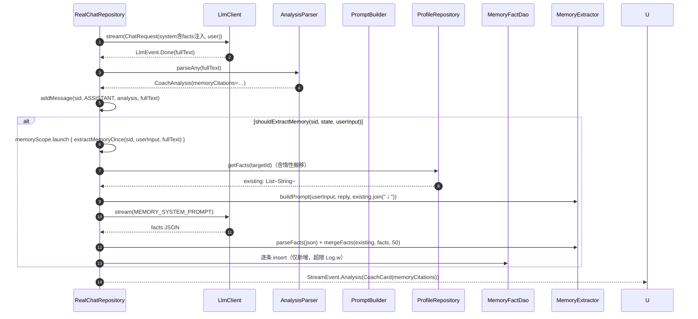
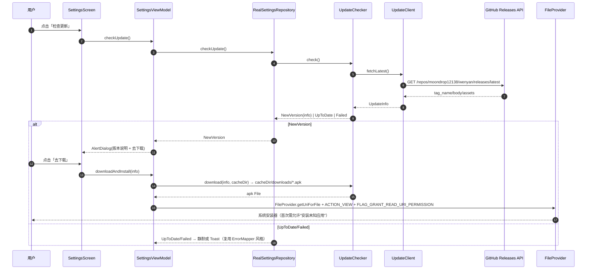
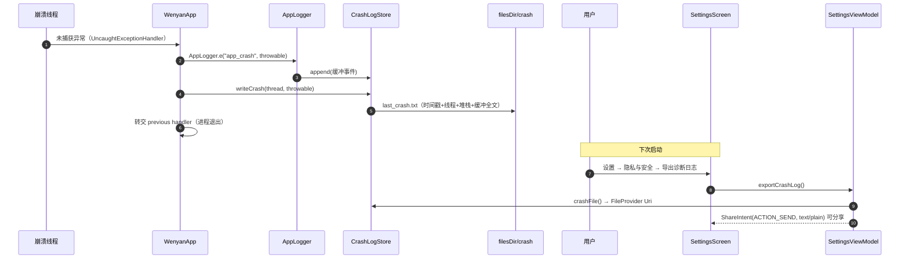
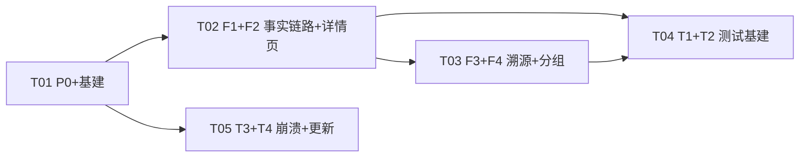

# 温言 v1.7.3 增量系统设计 + 任务分解

> 架构师：高见远（Bob）｜日期：2026-08-07
> 依据：PRD（`docs/prd-memory-v173.md`，R0-R8）+ 已评审迭代计划（`~/.workbuddy/plans/wenyan-v173-roadmap.md` §3 方案 + §5 文件清单）
> 基础版本：v1.7.2（versionCode 27，已发版）→ v1.7.3（versionCode 28）
> 范围：增量开发，仅在既有代码上改造，**最小变更、不重构无关模块**。

---

## 0. P0 现状核实（以代码为准）

**结论：P0 尚未修复（工程师任务 #1 进行中，工作区无源码改动）。**

- 核实方式：`git status` 仅见未跟踪的 `docs/prd-memory-v173.md`，`git diff` 为空——v1.7.2 代码原样，P0 崩溃仍在。
- 已阅读 `SettingsScreen.kt`「记忆」分组（LazyColumn 第 188-252 行：`ThickDivider` + `SettingsSectionHeader("记忆")` + `items(targets, key={it.id})` + 添加记忆行 + 自动记忆 Switch 行）。**无法仅凭静态阅读 100% 定位根因**，必须抓崩溃堆栈。
- 本设计将 P0 作为**批次 A 首位任务 T01 的第 1 子项**：若工程师已修复 → 按 §0.1 回归验证；若未修复 → 按 §0.2 定位步骤执行。

### 0.1 若已修复：回归验证项（工程师完成后 QA 必测）
1. 设置页下滑至「记忆」分组（含空档案 / 有档案 / 有激活档案三种状态）不再闪退；
2. 记忆分组内：档案行点击切换激活 Toast、编辑图标弹窗、删除图标弹窗、自动记忆 Switch 均正常；
3. 从记忆分组继续下滑至「外观」「隐私与安全」分组不闪退；
4. `adb logcat` 无 `AndroidRuntime FATAL`；
5. 全量 JVM 回归（`./gradlew testDebugUnitTest`）。

### 0.2 若未修复：定位步骤（工程师执行）
1. **抓堆栈（第一优先）**：`adb logcat -b crash` 复现"下滑至记忆分组"，拿到 `FATAL EXCEPTION` 堆栈，按堆栈指向定位；
2. 静态排查优先级（按代码阅读给出的候选）：
   - **候选 A**：`LazyColumn` `items(targets, key={it.id})` 若 `targets` 出现重复 id（如 DB 脏数据/两档案同 id）会抛 `IllegalArgumentException: Key ... was already used` → 用 SQL 核对 `SELECT id, COUNT(*) FROM target GROUP BY id HAVING COUNT(*)>1`；
   - **候选 B**：`ThickDivider`（`GtjCard.kt` L53）内 `HorizontalDivider` 在 `Box(fillMaxWidth().height(8.dp))` 中未铺满——布局问题非崩溃；但若 M3 版本不匹配 `HorizontalDivider` 可能 `NoSuchMethodError` → 确认 BOM 2025.06.01 已含；
   - **候选 C**：`liquidGlass` `drawWithCache`（`LiquidGlass.kt`）在 LazyColumn 组合期 item 尺寸为 0 时 `createOutline`/`BlurMaskFilter` 异常 → 堆栈指向 `LiquidGlass` 则给 `GlassSurface` 加最小尺寸守卫；
   - **候选 D**：`MemoryTargetRow` 内嵌套可点击（`GlassSurface(onClick)` + 两个 `GtjIconButton`）——ProviderEditScreen 同款已稳定，概率低；
3. 修复后按 §0.1 回归。

---

## Part A：系统设计

## 1. 实现方案概述

### 1.1 增量最小变更原则
- 不重写既有模块；在 v1.7.2 产物上做**定点改造**：新增 `memory_fact` 表 + 业务层惰性搬移 + 注入链路改读 facts + 新页面复用现成组件（MbtiPicker/SliderField/ProviderEdit 二级页范式）。
- DB 迁移只做结构（建表），**数据搬移在业务层**（符合 Room 规范，避免在 Migration 里写业务逻辑）。
- 更新检查/崩溃日志均为**新增独立模块**，不侵入既有 LLM/知识链路。

### 1.2 核心难点与选型
| 难点 | 方案 | 选型/理由 |
|---|---|---|
| 老 note 数据无损迁移 | 业务层惰性搬移：首启/首访时 note 非空且 facts 空 → `splitSegments` 拆分逐条 INSERT → 清空 note | 复用既有 `MemoryExtractor.splitSegments`（现为 private，改造为 public 工具） |
| 单条事实去重/上限 | `mergeNote` → `mergeFacts(existing, facts, limit=50)` 逐条 overlaps 去重 | 复用既有 overlaps 判定，JVM 可测 |
| 注入链路兼容 | `resolveTarget` 后取 `memoryText = facts.joinToString("；").take(2000)`，以 `target.copy(note=memoryText)` 传 PromptBuilder | **PromptBuilder 零改动**（memory 字段仍读 `target.note`） |
| 溯源字段兼容 | schema v2 加根级 `memory_citations`（≤3，默认空数组）；`parseV2Json` 防御解析 | 老回答/解析失败自动空数组 |
| 会话分组 | 纯 UI 层 `groupBy(targetName)` + 组头；数据层/契约不动 | 最小侵入 |
| 迁移测试 | `room-testing:2.6.1` + androidTest assets 指向 schemas | MigrationTestHelper 读 1-6.json |
| 崩溃兜底 | `CrashLogStore` 环形缓冲 + 崩溃回调落盘 + FileProvider 导出 | 首次引入 FileProvider |
| 更新检查 | 直连 GitHub Releases API + OkHttp 下载 + FileProvider 安装 | 仓库转 public 后可用 |

### 1.3 架构模式
- 沿用现状：**单向数据流（Repository → ViewModel → Composable）+ 契约接口（`ui/contract/*`）+ 容器装配（`RealAppContainer`）**。
- 新增模块同样遵循：数据访问（Room DAO）→ 业务 Repository（ProfileRepository 扩展）→ 契约（SettingsRepository 扩展）→ UI。

---

## 2. 文件列表

### 2.1 新增（12 个）
| 文件 | 职责 |
|---|---|
| `data/db/MemoryFactEntity.kt` | memory_fact 表实体（id/targetId FK CASCADE/text/createdAt + 索引） |
| `data/db/MemoryFactDao.kt` | facts CRUD + observeByTarget + clear（FK CASCADE 随档案删除联动） |
| `ui/settings/MemoryEditScreen.kt` | 档案详情页（F1+F2 合并）：结构化字段编辑 + 已记住事实列表（仿 ProviderEditScreen 二级页范式） |
| `ui/settings/MemoryEditViewModel.kt` | 详情页状态装配（加载档案 + facts、保存字段、增删改事实） |
| `log/CrashLogStore.kt` | 环形缓冲（100 条）+ 崩溃落盘 `filesDir/crash/last_crash.txt` + clear |
| `data/update/UpdateClient.kt` | GitHub Releases API 客户端（GET latest release，解析 tag_name/body/assets） |
| `data/update/UpdateChecker.kt` | 版本比较 + 下载 APK 到 cacheDir + 错误归一（UpdateCheckResult） |
| `res/xml/file_paths.xml` | FileProvider 路径：`files-path crash/` + `cache-path downloads/` |
| `androidTest/java/com/wenyan/app/db/MigrationTest.kt` | v1→v2→v3→v4→v5→v6 全链路 + 直接 v1→v6 双路径 + 数据保留断言 |
| `androidTest/java/com/wenyan/app/ui/settings/MemorySettingsFlowTest.kt` | 添加→选中→改名→删除确认流（createComposeRule + GtjTheme） |
| `androidTest/java/com/wenyan/app/ui/settings/MemoryDialogsTest.kt` | 三弹窗交互（新建/编辑/删除确认） |
| `androidTest/java/com/wenyan/app/ui/chat/SessionDrawerGroupTest.kt` | 会话分组头渲染 + 未关联置底 |

### 2.2 修改（23 个）
| 文件 | 改动点 |
|---|---|
| `app/build.gradle.kts` | versionCode 27→28、versionName "1.7.2"→"1.7.3"（注释追加）；`androidTestImplementation("androidx.room:room-testing:2.6.1")`；`sourceSets.getByName("androidTest").assets.srcDir("$projectDir/schemas")` |
| `data/db/AppDatabase.kt` | entities 加 `MemoryFactEntity`；version 5→6；新增 `MIGRATION_5_6`（建 memory_fact 表 + 索引）；`abstract fun memoryFactDao()`；`addMigrations(..., MIGRATION_5_6)` |
| `data/repository/ProfileRepository.kt` | 注入 `MemoryFactDao`；新增 facts API（observeFacts/getFacts/addFact/updateFact/deleteFact/countFacts/migrateNoteToFactsOnce/memoryText）；`clearAll()` 加 `memoryFactDao.clear()` |
| `domain/MemoryExtractor.kt` | 新增 `mergeFacts(existing: List<String>, facts: List<String>, limit: Int=50): List<String>`（逐条 overlaps 去重 + 上限）；`splitSegments` 提为 public `splitNoteToFacts(note): List<String>` 供搬移 |
| `container/RealChatRepository.kt` | `resolveTarget` 后注入 memoryText（facts join）；`extractMemoryOnce` 改写 facts（mergeFacts → 逐条 insert）；`MEMORY_SYSTEM_PROMPT` 沿用；上限 50 超限 Log.w |
| `container/RealSettingsRepository.kt` | `targets`/`TargetUi` 扩展结构化字段；新增 facts CRUD + `updateTargetDetails`（全字段）；`updateTarget(id,name,note)` 保留兼容或改为全字段；`wipeAll` 增删 crash 目录与下载缓存（经 CrashLogStore.clear） |
| `container/RealAppContainer.kt` | 装配 `memoryFactDao` → ProfileRepository；装配 `UpdateClient/UpdateChecker`、`CrashLogStore` 暴露给 SettingsRepository/ViewModel |
| `ui/contract/Models.kt` | `TargetUi` 加 mbti/score/relationStatus/timeline；新增 `MemoryFactUi(id,text,createdAt)`；`CoachCard` 加 `memoryCitations: List<String>` |
| `ui/contract/Repositories.kt` | `SettingsRepository` 契约扩展：`observeFacts/addFact/updateFact/deleteFact/updateTargetDetails/exportCrashLog/checkUpdate` |
| `container/UiMappers.kt` | `toTargetUi` 映射全字段；新增 `toMemoryFactUi`；`toCoachCard` 加 `memoryCitations` |
| `ui/settings/SettingsScreen.kt` | 档案行「编辑」图标 → 跳 MemoryEdit 页（替代改名弹窗）；「隐私与安全」加「导出诊断日志」行；「关于」区加「检查更新」行；各组件补 `@Preview` |
| `ui/settings/SettingsViewModel.kt` | 新增：facts 状态、更新检查/下载状态、导出日志动作；`requestEditTarget` 改跳页参数 |
| `ui/settings/MemoryDialogs.kt` | 保留新建/删除弹窗；编辑弹窗移除（改跳 MemoryEdit 页）；补 `@Preview` |
| `ui/navigation/AppNavigator.kt` | `Route` 加 `data class MemoryEdit(val targetId: Long)` |
| `ui/navigation/AppRoot.kt` | `MemoryEdit` 分支渲染 MemoryEditScreen（仿 ProviderEdit 模式） |
| `ui/chat/SessionDrawer.kt` | 按 `targetName` groupBy（组内时间倒序）；每组前加档案名组头（accentSoft 小字）；`targetName=null` 归「未关联」组放最后；条目补 `@Preview` |
| `prompt/CorePrompt.kt` | `structuredOutput` 根级加 `memory_citations`（≤3 条，未使用空数组）+ 说明；`memoryRule` 补「引用记忆时将其原文列入 memory_citations」 |
| `llm/AnalysisParser.kt` | `parseV2Json` 加 `memoryCitations = parseStringArray(json.optJSONArray("memory_citations")).take(3)`（防御默认空） |
| `llm/CoachAnalysis.kt` | 加 `memoryCitations: List<String> = emptyList()`；`FiveStepAnalysis.toCoachAnalysis` 映射空 |
| `ui/components/CoachCard.kt` | 知识引用区旁新增「记忆依据」小节（muted 小字 + 「」引用，非空才显示） |
| `log/AppLogger.kt` | 加环形缓冲写入钩子（`CrashLogStore` 注入，d/i/w/e 同步进缓冲） |
| `WenyanApp.kt` | `installCrashLogger` 崩溃回调写 `filesDir/crash/last_crash.txt`（时间戳+线程+堆栈+缓冲全文） |
| `AndroidManifest.xml` | 首次引入 FileProvider（`androidx.core.content.FileProvider` + `file_paths.xml`）；INTERNET 已有 |

> 与 roadmap §5 差异说明：`TargetDao.kt` 无需改动（`@Update` 已全字段覆盖）；新增 `RealAppContainer.kt`/`Repositories.kt` 两项装配与契约文件，故 23 改 12 新（roadmap 为 22 改 12 新，差异为上述两文件归类）。

---

## 3. 数据结构与接口

### 3.1 DB v6 迁移（AppDatabase.kt）

```sql
-- MIGRATION_5_6：只建表，数据搬移在业务层
CREATE TABLE IF NOT EXISTS `memory_fact` (
    `id` INTEGER PRIMARY KEY AUTOINCREMENT NOT NULL,
    `targetId` INTEGER NOT NULL,
    `text` TEXT NOT NULL,
    `createdAt` INTEGER NOT NULL,
    FOREIGN KEY(`targetId`) REFERENCES `target`(`id`) ON UPDATE NO ACTION ON DELETE CASCADE
)
CREATE INDEX IF NOT EXISTS `index_memory_fact_targetId` ON `memory_fact` (`targetId`)
```

- `MemoryFactEntity`：`@Entity(tableName="memory_fact", foreignKeys=[ForeignKey(TargetEntity, ["id"], ["targetId"], onDelete=CASCADE)], indices=[Index("targetId")])`
- 迁移后导出 `schemas/com.wenyan.app.data.db.AppDatabase/6.json` 入库。

### 3.2 惰性数据搬移方案（ProfileRepository）

```
migrateNoteToFactsOnce(targetId):
  target = getTarget(targetId) ?: return
  if target.note.isBlank() return            // 无老数据
  if countFacts(targetId) > 0 return          // 已搬移（幂等）
  segments = MemoryExtractor.splitNoteToFacts(target.note)  // 拆分+trim+去空+≤40字
  segments.take(50).forEach { addFact(targetId, it) }
  updateTarget(target.copy(note = ""))        // note 列保留防旧数据，代码层不再写入
```

调用时机：`memoryText()` 内（即 resolveTarget 注入前）、`MemoryEditViewModel` 加载时。幂等 + 失败静默（runCatching）。

### 3.3 MemoryFactDao / ProfileRepository 新 API

```kotlin
@Dao
interface MemoryFactDao {
    @Query("SELECT * FROM memory_fact WHERE targetId = :targetId ORDER BY createdAt DESC, id DESC")
    fun observeByTarget(targetId: Long): Flow<List<MemoryFactEntity>>

    @Query("SELECT * FROM memory_fact WHERE targetId = :targetId ORDER BY createdAt DESC, id DESC")
    suspend fun listByTarget(targetId: Long): List<MemoryFactEntity>

    @Query("SELECT * FROM memory_fact WHERE id = :id")
    suspend fun getById(id: Long): MemoryFactEntity?

    @Insert suspend fun insert(entity: MemoryFactEntity): Long
    @Update suspend fun update(entity: MemoryFactEntity)
    @Query("DELETE FROM memory_fact WHERE id = :id") suspend fun deleteById(id: Long)
    @Query("DELETE FROM memory_fact WHERE targetId = :targetId") suspend fun deleteByTarget(targetId: Long)
    @Query("DELETE FROM memory_fact") suspend fun clear()
}
```

```kotlin
// ProfileRepository 扩展（注入 memoryFactDao）
fun observeFacts(targetId: Long): Flow<List<MemoryFactEntity>>
suspend fun getFacts(targetId: Long): List<MemoryFactEntity>
suspend fun addFact(targetId: Long, text: String): Long
suspend fun updateFact(factId: Long, text: String)
suspend fun deleteFact(factId: Long)
suspend fun countFacts(targetId: Long): Int
suspend fun migrateNoteToFactsOnce(targetId: Long)     // §3.2
suspend fun memoryText(targetId: Long): String          // migrate 后 facts.joinToString("；").take(2000)
```

```kotlin
// MemoryExtractor 扩展
fun mergeFacts(existing: List<String>, facts: List<String>, limit: Int = 50): List<String>
// trim+去空；facts 逐条与 existing 所有片段 overlaps 判定去重；保序追加；总条数 take(limit)
fun splitNoteToFacts(note: String): List<String>        // splitSegments 提为 public（\n。；切分+trim+去空）
```

### 3.4 SettingsRepository 契约扩展（ui/contract/Repositories.kt）

```kotlin
// —— v1.7.3 事实单条管理 + 档案详情编辑 ——
fun observeFacts(targetId: Long): Flow<List<MemoryFactUi>>
suspend fun addFact(targetId: Long, text: String)
suspend fun updateFact(factId: Long, text: String)
suspend fun deleteFact(factId: Long)

/** 全字段保存（名称/MBTI/吸引力分/关系状态/关键事件 timeline JSON 数组） */
suspend fun updateTargetDetails(
    id: Long, name: String, mbti: String?, score: Int?,
    relationStatus: String?, timelineJson: String,
)

/** T3 导出诊断日志：返回可分享的 crash 文件 Uri（无则 null） */
suspend fun exportCrashLog(): android.net.Uri?

/** T4 检查更新：NewVersion / UpToDate / Failed */
suspend fun checkUpdate(): UpdateCheckResult
```

### 3.5 CoachAnalysis.memoryCitations + schema v2

```kotlin
// llm/CoachAnalysis.kt
data class CoachAnalysis(
    ...,
    val citations: List<String> = emptyList(),
    val memoryCitations: List<String> = emptyList(),   // 新增
    ...
)
// FiveStepAnalysis.toCoachAnalysis() → memoryCitations = emptyList()
```

```kotlin
// llm/AnalysisParser.parseV2Json 新增一行（防御默认空，五步法兼容映射为空）
memoryCitations = parseStringArray(json.optJSONArray("memory_citations")).take(3),
```

```json
// prompt/CorePrompt.structuredOutput schema v2 根级新增
"memory_citations": ["实际依据的已记住事实原文，≤3 条；未使用留空数组"],
// memoryRule 补一句：
// - 引用记忆时，将其原文逐字列入 memory_citations（≤3 条）；未引用则留空数组。
```

### 3.6 UpdateChecker / UpdateClient（data/update/）

```kotlin
// GET https://api.github.com/repos/moondrop12138/wenyan/releases/latest （仓库即将 public）
// 解析：tag_name → versionName（去 "v" 前缀）；body → notes；assets[].browser_download_url（.apk 结尾）→ apkUrl
data class UpdateInfo(
    val versionName: String,   // 如 "1.7.3"
    val versionCode: Int,      // 从 tag 解析失败回退 0（"v1.7.3" → 数字段 1*10000+7*100+3）
    val apkUrl: String,
    val notes: String,
)

sealed interface UpdateCheckResult {
    data class NewVersion(val info: UpdateInfo) : UpdateCheckResult
    data object UpToDate : UpdateCheckResult
    data class Failed(val code: String, val message: String) : UpdateCheckResult
    // 错误码约定：UPDATE_NETWORK / UPDATE_PARSE / UPDATE_NO_ASSET / UPDATE_DOWNLOAD / UPDATE_INSTALL
}

class UpdateClient(private val okHttp: OkHttpClient) {
    suspend fun fetchLatest(): UpdateInfo?   // 失败返回 null（runCatching + 超时）
}

class UpdateChecker(
    private val client: UpdateClient,
    private val currentVersionName: String,  // BuildConfig.VERSION_NAME
    private val currentVersionCode: Int,     // BuildConfig.VERSION_CODE
) {
    suspend fun check(): UpdateCheckResult   // 版本比较：versionCode 优先，缺省回退 versionName 段比较
    suspend fun download(info: UpdateInfo, cacheDir: File): File?  // cacheDir/downloads/wenyan-{version}.apk
}
```

### 3.7 CrashLogStore（log/）

```kotlin
class CrashLogStore(private val context: Context) {
    // 环形内存缓冲：最近 100 条 AppLogger 事件（synchronized，事件格式含隐私红线）
    fun append(line: String)
    fun snapshot(): String
    // 崩溃回调：写 filesDir/crash/last_crash.txt（时间戳 + 线程 + 堆栈 + 缓冲全文）；返回文件/null
    fun writeCrash(thread: Thread, throwable: Throwable): File?
    fun crashFile(): File?                    // filesDir/crash/last_crash.txt
    fun clear()                               // 删 crash 目录 + cacheDir/downloads（wipeAll 联动）
}
```

### 3.8 类图（详见 docs/class-diagram.mermaid）



---

## 4. 程序调用流程（详见 docs/sequence-diagram.mermaid）

### 4.1 档案详情页编辑保存（F1+F2）



### 4.2 回答完成提炼 + 溯源解析（F1+F3）



### 4.3 更新检查下载安装（T4）



### 4.4 崩溃落盘导出（T3）



---

## 5. 待明确事项

1. **P0 根因**：以工程师 `logcat` 堆栈为准（§0.2 已给候选与定位步骤）；本设计不臆断根因。
2. **GitHub Release asset 命名**：约定 APK asset 以 `.apk` 结尾即视为安装包；若未来多 APK（arm64/universal），需在 Release 命名加前缀约定（本版本取第一个 `.apk` asset）。
3. **仓库转 public 时间点**：T4 联调依赖仓库 public；public 前 `checkUpdate` 返回 `Failed(UPDATE_NETWORK)` 属预期，UI 静默处理。
4. **androidTest 运行环境**：本机无模拟器 → 先保证 `assembleAndroidTest` 编译通过 + 实机验证；CI 增 instrumentation job 为可选（见 §6 依赖与 CI 现状）。

---

## Part B：任务分解

## 6. 依赖包

```
- androidx.room:room-testing:2.6.1（androidTestImplementation，新增，与 room 主版本一致）
```

其余**确认无新增**（已存在）：
- `androidx.compose.ui:ui-tooling-preview`（@Preview）
- `androidx.compose.ui:ui-test-junit4` + `androidx.test.ext:junit:1.2.1` + `espresso-core:3.6.1`（androidTest）
- `androidx.core:core`（FileProvider，经 activity-compose 传递依赖；如需显式可加 `androidx.core:core-ktx`）
- `com.squareup.okhttp3:okhttp:4.12.0`（更新检查/下载）
- INTERNET 权限已在 AndroidManifest.xml

**androidTest assets 指向**（build.gradle.kts）：
```kotlin
android {
    sourceSets {
        getByName("androidTest").assets.srcDir("$projectDir/schemas")
    }
}
```

**CI 现状**（.github/workflows/ci.yml）：仅 `testDebugUnitTest` + `assembleDebug`，无 instrumentation job；androidTest 需模拟器/真机，本机无 emulator → CI 增 instrumentation job 为**可选**（P2，本版本保证 `assembleAndroidTest` 编译通过 + 实机验证）。

## 7. 任务列表（按批次 A→D，共 5 个任务）

> 依赖：T01（基建）→ 全部；T02 → T01；T03 → T02（部分依赖 Models/UiMappers）；T04 → T02、T03（测试对象稳定）；T05 → T01。

### T01（批次 A·首位：P0 修复验证 + 项目基础设施）— P0
- **Source Files**：`app/build.gradle.kts`、`data/db/AppDatabase.kt`、`data/db/MemoryFactEntity.kt`（新）、`data/db/MemoryFactDao.kt`（新）、`AndroidManifest.xml`、`res/xml/file_paths.xml`（新）、`ui/settings/SettingsScreen.kt`（仅 P0 定位涉及）、`ui/settings/SettingsViewModel.kt`（仅 P0 定位涉及）
- **Dependencies**：无
- **Priority**：P0
- **内容**：
  1. **P0**：若工程师已修 → §0.1 回归验证；未修 → §0.2 定位修复（logcat 堆栈优先）；
  2. 版本号 28 / "1.7.3"；
  3. DB v6：`MemoryFactEntity` + `MemoryFactDao` + `MIGRATION_5_6` + `memoryFactDao()` + 导出 `6.json`；
  4. androidTest 基建：`room-testing` 依赖 + `sourceSets` assets 指向 schemas；
  5. FileProvider：manifest provider + `file_paths.xml`（crash/ + downloads/）。

### T02（批次 A：F1 事实链路 + F2 档案详情页）
- **Source Files**：`data/repository/ProfileRepository.kt`、`domain/MemoryExtractor.kt`、`container/RealChatRepository.kt`、`container/RealSettingsRepository.kt`、`container/RealAppContainer.kt`、`ui/contract/Models.kt`、`ui/contract/Repositories.kt`、`container/UiMappers.kt`、`ui/settings/MemoryEditScreen.kt`（新）、`ui/settings/MemoryEditViewModel.kt`（新）、`ui/settings/SettingsScreen.kt`、`ui/settings/SettingsViewModel.kt`、`ui/settings/MemoryDialogs.kt`、`ui/navigation/AppNavigator.kt`、`ui/navigation/AppRoot.kt`
- **Dependencies**：T01
- **Priority**：P1
- **内容**：facts 数据层（DAO/Repository/Extractor/注入/提炼）+ MemoryEditScreen 详情页（结构化字段 + 事实列表单条管理）+ 路由 + 契约扩展 + UiMappers 全字段映射；惰性搬移幂等；上限 50。

### T03（批次 B：F3 记忆引用溯源 + F4 会话分组）
- **Source Files**：`prompt/CorePrompt.kt`、`llm/AnalysisParser.kt`、`llm/CoachAnalysis.kt`、`ui/contract/Models.kt`、`container/UiMappers.kt`、`ui/components/CoachCard.kt`、`ui/chat/SessionDrawer.kt`
- **Dependencies**：T02
- **Priority**：P1
- **内容**：schema v2 `memory_citations` + 防御解析 + CoachCard「记忆依据」小节；SessionDrawer 按档案分组（未关联置底）。

### T04（批次 C：T1 迁移测试 + T2 UI 测试/@Preview）
- **Source Files**：`androidTest/java/com/wenyan/app/db/MigrationTest.kt`（新）、`androidTest/java/com/wenyan/app/ui/settings/MemorySettingsFlowTest.kt`（新）、`androidTest/java/com/wenyan/app/ui/settings/MemoryDialogsTest.kt`（新）、`androidTest/java/com/wenyan/app/ui/chat/SessionDrawerGroupTest.kt`（新）、`ui/settings/SettingsScreen.kt`（@Preview）、`ui/settings/MemoryDialogs.kt`（@Preview）、`ui/chat/SessionDrawer.kt`（@Preview）、`ui/components/CoachCard.kt`（@Preview）
- **Dependencies**：T02、T03
- **Priority**：P1
- **内容**：MigrationTest（v1→v6 双路径 + 数据保留断言）；3 个 UI 测试；@Preview 补丁（档案行/记忆分组/三弹窗/会话条目）。

### T05（批次 D：T3 崩溃日志 + T4 更新检查）
- **Source Files**：`log/CrashLogStore.kt`（新）、`log/AppLogger.kt`、`WenyanApp.kt`、`data/update/UpdateClient.kt`（新）、`data/update/UpdateChecker.kt`（新）、`container/RealAppContainer.kt`、`ui/settings/SettingsViewModel.kt`、`ui/settings/SettingsScreen.kt`、`container/RealSettingsRepository.kt`
- **Dependencies**：T01
- **Priority**：P1
- **内容**：崩溃落盘 + 导出诊断日志（FileProvider + ShareIntent）+ wipeAll 联动清 crash/下载；更新检查（GitHub Releases + 版本比较 + 下载 APK + ACTION_VIEW 安装 + 错误静默/Toast）。

### 任务依赖图



---

## 8. 共享知识（工程师全局须知）

- **memory_fact 条数上限**：每档案 ≤50 条；超出静默丢弃新事实并 `Log.w("RealChatRepository", "memory facts cap reached")`。
- **单条事实**：提炼约束 ≤40 字（parseFacts 已 take(40)）；手工编辑不强制截断但 UI 提示。
- **note 废弃规则**：v1.7.3 起代码层不再写入 `target.note`；老数据经惰性搬移拆散为 facts 后清空 note；note 列保留防旧数据回滚。
- **事实注入**：`facts.joinToString("；").take(2000)` 截断；`PromptBuilder.buildProfileJson` 仍读 `target.note`（调用方以 `target.copy(note=memoryText)` 注入，**PromptBuilder 零改动**）。
- **更新检查 URL/错误码**：`GET https://api.github.com/repos/moondrop12138/wenyan/releases/latest`；错误码 `UPDATE_NETWORK / UPDATE_PARSE / UPDATE_NO_ASSET / UPDATE_DOWNLOAD / UPDATE_INSTALL`，UI 静默或 Toast（复用 ErrorMapper 风格文案），不阻塞主流程。
- **崩溃日志隐私红线**：AppLogger 事件格式只含事件与元数据（计数/耗时/错误码/命中关键词），**禁止**传入用户内容明文（聊天文本/档案正文/记忆/API Key）；`last_crash.txt` 与「导出诊断日志」同受红线约束。
- **Tag/分组规则**：SessionDrawer 按 `targetName` 分组，组内时间倒序；`targetName=null` 归「未关联」组**放最后**；组头 accentSoft 小字，风格对齐「最近会话」标题。
- **时间戳**：一律毫秒 epoch（`System.currentTimeMillis()`），UI 层负责格式化。
- **DB 迁移铁律**：Room Migration 只做结构（建表/加列），**业务数据搬移一律走业务层**（惰性迁移幂等）；schema JSON 必须提交入库。
- **契约层**：UI 只依赖 `ui/contract/*` 接口；新增字段必须同步 `Models.kt` + `UiMappers` + `RealSettingsRepository` 三处。

## 9. 交付物
- 本设计：`docs/design-memory-v173.md`
- 类图：`docs/class-diagram.mermaid`
- 时序图：`docs/sequence-diagram.mermaid`
- 构建门禁：`bash app/scripts/run_gradle.sh`；androidTest 无模拟器则先 `assembleAndroidTest` 编译通过 + 实机验证。
